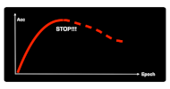
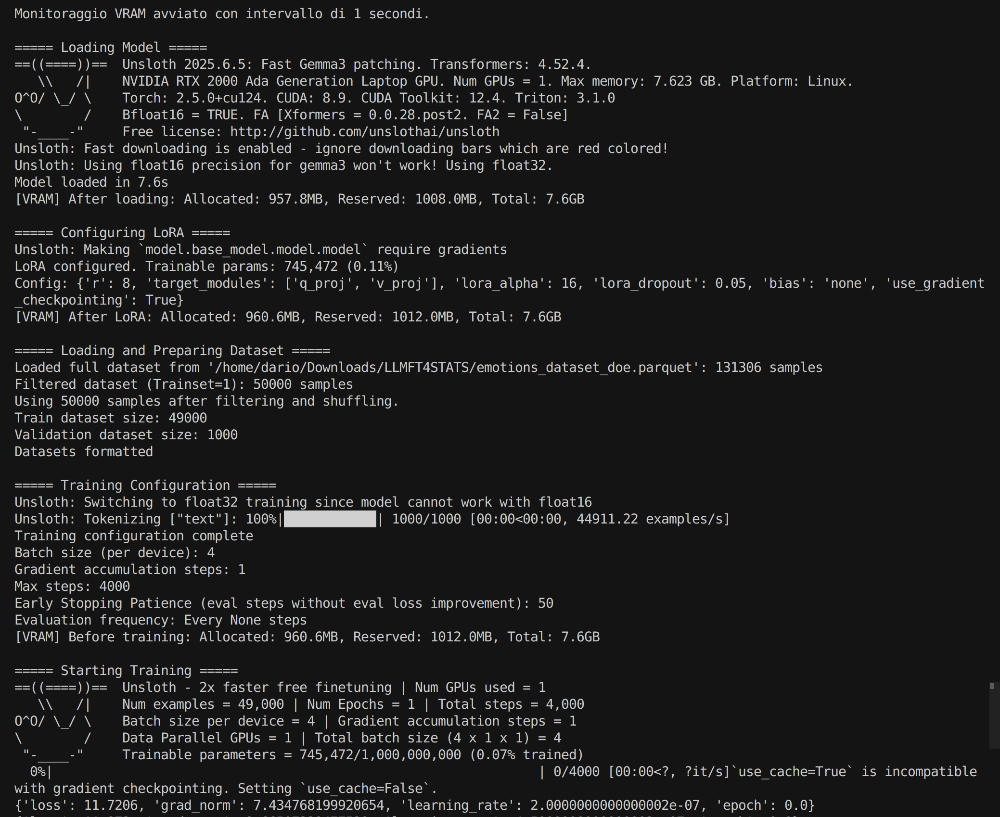
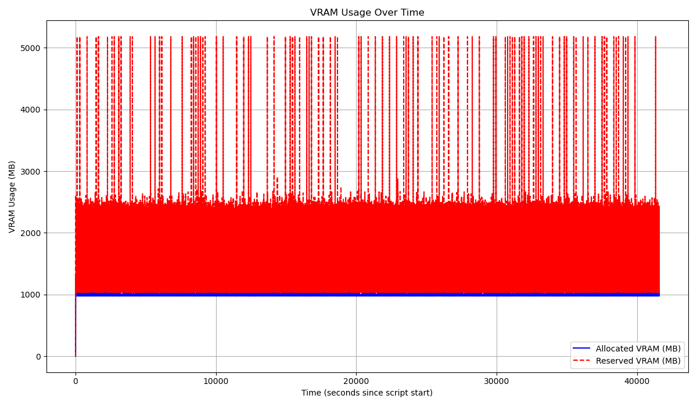
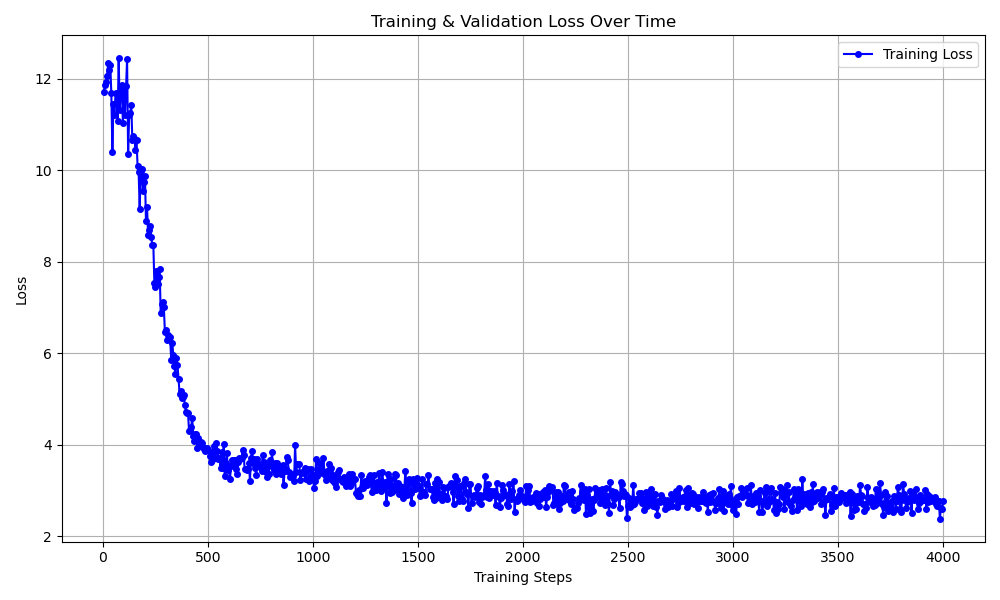

# DoE

Quando si parla di __Design of Experiment (DoE)__, di solito pensiamo a un metodo statistico per pianificare esperimenti. L'idea è semplice: vogliamo capire come diverse _variabili (o fattori)_ influenzano un certo _risultato (o risposta)_, cercando di ottenere il massimo delle informazioni con il minor numero di prove e garantendo che i nostri risultati siano validi ed efficienti.

Tuttavia, nel contesto di questo tutorial, _il DoE assume una sfumatura un po' diversa_. Non stiamo progettando un esperimento per testare direttamente l'impatto di alcune variabili su un modello. Invece, stiamo applicando i principi del DoE per _definire con cura il dataset (il "trainset")_ che useremo. Questo trainset sarà fondamentale per due scopi:

- __Predisporre il fine-tuning di un Large Language Model (LLM).__
- __Addestrare i modelli di AI tradizionale.__

Il nostro obiettivo qui è chiaro: selezionare un sottoinsieme di osservazioni che sia il più rappresentativo, bilanciato e informato possibile, massimizzando l'efficacia del fine-tuning.

## Perché la scelta del Trainset è cruciale?
Il [codice](https://github.com/Mahalanobis/Mahalanobis.io/blob/main/code/FT_Emotions_Dataset_DOE.py) seleziona un trainset relativamente piccolo, appena 50.000 frasi. 

Questa non è una scelta casuale! Vogliamo esplorare un aspetto fondamentale della recente letteratura sugli LLM, che suggerisce come il __fine-tuning__ di un modello pre-trained possa essere incredibilmente efficace anche con un numero limitato di casi. Vogliamo verificare questa ipotesi, testando la capacità di generalizzazione di un LLM anche con un trainset più contenuto.

Ma c'è di più. La scelta di un _trainingset bilanciato_ è di importanza critica. Immaginate di voler insegnare a un bambino a riconoscere gli animali. Se gli mostraste solo gatti, il bambino diventerebbe un "esperto" di gatti, ma farebbe fatica a riconoscere un cane o un uccello. Allo stesso modo, un dataset sbilanciato – dove alcune categorie (come certe emozioni o argomenti) sono sovra-rappresentate – porterebbe l'LLM a:

* __Sovra-apprendere le categorie più frequenti__, diventando troppo specializzato su quelle.
* __Sotto-stimare o addirittura ignorare le categorie meno comuni__, che potrebbero però essere altrettanto importanti per i nostri obiettivi.

Un trainset bilanciato, al contrario, assicura che il modello sia esposto a tutte le sfumature e varietà presenti nei dati. Questo lo rende più __robusto__ e capace di __generalizzare__ bene anche su osservazioni che non rientrano nelle categorie più comuni.

A questo scopo abbiamo deciso di selezionarlo con un campionamento casuale pesato, dove ogni frase riceve una probabilità di essere selezionata in funzione delle tipologie di emozioni (Label) e della varietà degli Embeddings (Umap10KMeans, una procedura di clustering che avevamo prodotto in fase di EDA).
Il peso, o la probabilità di selezione di una frase è fatta in modo da bilanciare la combinazione {Tipo di Emozione ; Tipo/Cluster di Embeddings} in modo che ognuna di queste sia equamente rappresentata.

Selezionate così 50.000 frasi che costituiscono il nostro _trainset_, le restanti 81.306 frasi saranno utilizzate per misurare l'_accuracy_ degli algoritmi di Gen-AI o "tradizionali" che andremo a sviluppare.

# Perchè Gemma3

In questo tutorial, il __fine-tuning__ verrà eseguito utilizzando il modello pre-trained [Gemma 3 1b it](https://huggingface.co/google/gemma-3-1b-it), un LLM messo a disposizione da Google e caratterizzato da "solo" un miliardo di parametri (1b). Per fare una comparazione si stima che ChatGPT 4, sviluppato da OpenAI, abbia tra 1000 e 2000 miliardi di parametri. La nostra decisione di adottare questo modello si basa su una serie di considerazioni strategiche, focalizzate sull'equilibrio tra _accessibilità_, _efficienza_ e _prestazioni_.

Quando abbiamo concepito un tutorial che fosse fruibile da un vasto pubblico, la nostra attenzione si è subito rivolta agli __Small Large Language Model (SLLM)__. Questi modelli, caratterizzati da un numero ridotto di parametri, sono progettati per essere altamente efficienti e performanti in compiti specifici, mantenendo al contempo un'elevata coerenza nella generazione del testo. Dopo aver sperimentato diverse opzioni open source disponibili, la famiglia _Gemma 3_ di _Google_ si è costantemente distinta come una delle più promettenti per la sua notevole capacità di seguire le istruzioni in modo coerente.

Siamo consapevoli che gli LLM, e in particolare gli SLLM, possono essere soggetti a ["allucinazioni"](https://en.wikipedia.org/wiki/Hallucination_(artificial_intelligence)) o mostrare difficoltà nel comprendere appieno le istruzioni impartite. Per esplorare e mitigare questi limiti, abbiamo condotto un esperimento specifico: abbiamo chiesto a un LLM di sintetizzare una frase o un documento di testo in una singola parola. Sebbene possa apparire un compito semplice, si è rivelato una sfida significativa per l'LLM mantenere la "disciplina" e completarlo correttamente in una sequenza di tentativi.

Questo esperimento si è rivelato estremamente funzionale per diverse ragioni:

* Ci ha permesso di valutare l'affidabilità di un LLM nella sintesi di informazioni verbali complesse in rappresentazioni concise, che possono essere utilizzate per rappresentazioni di sintesi, come grafici o altre forme di espressione.

* La capacità di sintetizzare una frase con una singola parola, quando possibile, apre la strada all'utilizzo e allo sfruttamento di ontologie basate sui vocabolari, che mirano a strutturare e organizzare la complessità semantica.

* Ci consente di riutilizzare modelli di Embeddings non contestualizzati, come [Word2Vec](https://www.tensorflow.org/text/tutorials/word2vec) o [FastText](https://fasttext.cc/).

Nonostante i vantaggi in termini di efficienza e costi computazionali, è importante riconoscere che gli SLLM come [Gemma 3 1b it](https://huggingface.co/google/gemma-3-1b-it) potrebbero non possedere la stessa profondità di conoscenza o la medesima capacità di gestire compiti estremamente complessi o ambigui rispetto a modelli con un numero di parametri significativamente maggiore. Tuttavia, per il contesto specifico di questo tutorial, focalizzato sulla classificazione delle emozioni, i benefici derivanti dall'efficienza e dall'accessibilità di [Gemma 3 1b it](https://huggingface.co/google/gemma-3-1b-it) superano ampiamente questi compromessi, rendendolo la scelta ottimale per dimostrare l'efficacia del fine-tuning con risorse limitate.

Un ulteriore elemento cruciale nella scelta di [Gemma 3 1b it](https://huggingface.co/google/gemma-3-1b-it) è la sua natura di modello "instruction tuned" (indicato dal suffisso "it" nel nome). Questo significa che il modello è stato pre-addestrato non solo su un vasto corpus di testo, ma anche specificamente ottimizzato per seguire istruzioni e formati di prompt. Questa caratteristica lo rende particolarmente adatto al fine-tuning per compiti specifici come la classificazione, in quanto è già predisposto a interpretare e rispondere a istruzioni ben definite, facilitando il processo di adattamento e migliorando le prestazioni sul dataset target.

Una [panoramica](https://ai.google.dev/gemma/docs/core/model_card_3?hl=it) su questo modello è stata messa a disposizione da Google stessa. Qui il [Technical Report](https://arxiv.org/abs/2503.19786).
 

# Fine-tuning

Il [codice](https://github.com/Mahalanobis/Mahalanobis.io/blob/main/code/FineTuning_Gemma3_1B_v0.py) implementa un processo di fine-tuning di un LLM, nello specifico [Gemma 3 1b it](https://huggingface.co/google/gemma-3-1b-it), specializzandosi nella classificazione delle emozioni. 

Il [fine-tuning](https://en.wikipedia.org/wiki/Fine-tuning_(deep_learning)) rappresenta una metodologia fondamentale nell'ambito dell'apprendimento automatico, in particolare per i Large Language Models (LLM). Si tratta del processo di adattamento di un modello pre-addestrato (_pre-trained_), che ha già acquisito una vasta comprensione del linguaggio su un corpus di dati generale e di grandi dimensioni, a un dataset più piccolo e specifico per un determinato dominio o compito. Questo approccio consente al modello di specializzarsi e migliorare significativamente le sue prestazioni su quel compito specifico, capitalizzando la conoscenza generale precedentemente acquisita ("_Transfer Learning_").

La rilevanza del fine-tuning deriva dalla sua capacità di bilanciare l'efficienza computazionale con la specificità del compito. Addestrare un modello di grandi dimensioni da zero è un'impresa che richiede risorse computazionali ingenti e tempi prolungati, spesso proibitivi per la maggior parte delle organizzazioni e dei singoli ricercatori. Partendo da una base solida fornita da un modello pre-addestrato, il fine-tuning accelera notevolmente il processo di sviluppo e consente di ottenere prestazioni superiori su dati di nicchia. I modelli pre-addestrati offrono una comprensione universale del linguaggio, e il fine-tuning colma il divario adattando questa conoscenza generale a dataset specifici, spesso di dimensioni ridotte. Questo rende l'elaborazione del linguaggio naturale accessibile e pratica per applicazioni specializzate, massimizzando l'utilità dei [foundation models](https://en.wikipedia.org/wiki/Foundation_model).

Nel nostro caso il fine-tuning specializzerà e migliorerà le prestazioni di [Gemma 3 1b it](https://huggingface.co/google/gemma-3-1b-it) relativamenta alla classificazione delle emozioni a partire da una frase in input.

Esistono diverse strategie per eseguire il fine-tuning, che si differenziano principalmente per la quantità di parametri del modello che vengono aggiornati durante l'addestramento: 

* il "full fine-tuning" implica l'aggiornamento di tutti i pesi e i parametri del modello pretrained, richiedendo significative risorse computazionali (come VRAM e tempi di calcolo) e un dataset di fine-tuning relativamente ampio; 

* al contrario, l'approccio utilizzato nel codice, noto come [Parameter-Efficient Fine-Tuning (PEFT)](https://arxiv.org/abs/2403.14608), e in particolare la logica LoRA (Low-Rank Adaptation), si concentra sull'addestramento di un numero molto più piccolo di parametri aggiuntivi o modificati, lasciando la maggior parte del modello originale congelata. Questo riduce drasticamente i requisiti di memoria e i tempi di addestramento, rendendo il fine-tuning accessibile anche su hardware meno potente, pur mantenendo prestazioni competitive. 

Il codice utilizza LoRA per adattare un modello [Gemma 3 1b it](https://huggingface.co/google/gemma-3-1b-it), focalizzandosi sull'addestramento di matrici di basso rango che vengono "iniettate" nel modello, consentendo un adattamento efficace senza la necessità di modificare l'intero modello.

## Prompting

Per addestrare efficacemente un LLM su un compito specifico come la classificazione delle emozioni, è essenziale presentare i dati al modello in un formato strutturato e coerente. Questa formattazione, spesso definita 'prompt' o 'template', guida il modello su come interpretare l'input e generare l'output desiderato. La funzione __formatting_func__ nel nostro codice è responsabile di trasformare ogni riga del dataset in questo formato specifico.

Una frase e la sua corrispettiva emozione possono essere convertite in un __prompt__ come questo:

'### Frase: \n{testo_della_frase}\n### Emozione: \n{etichetta_dell_emozione}<|endoftext|>'

Questa struttura indica chiaramente al modello quale parte è l'input (Frase:) e quale l'output atteso (Emozione:). Il tokenizer (caricato insieme al modello) è poi responsabile di convertire questo testo formattato in una sequenza di token numerici che il modello può elaborare.

Vantaggi di questo approccio:

* Chiara separazione tra input e output: L'uso dei tag <start_of_turn>user e <start_of_turn>model replica un formato di conversazione che molti LLM moderni sono abituati a processare. Questo aiuta il modello a capire chiaramente cosa è l'input (la frase da classificare) e cosa è l'output atteso (l'emozione).

* Identificazione del compito: La frase "Identify emotion:" è una istruzione esplicita che guida il modello verso il compito specifico che deve eseguire. Questo è fondamentale per il fine-tuning.

* Token di fine sequenza (tokenizer.eos_token): L'aggiunta del tokenizer.eos_token alla fine di ogni esempio è cruciale. Indica al modello che la sequenza corrente è terminata, il che è vitale per l'addestramento e la generazione.

* Batching: L'uso di batched=True nella funzione .map() è efficiente perché elabora più esempi contemporaneamente, velocizzando la preparazione del dataset.

* Coerenza delle etichette: Durante l'EDA del dataset ci siamo assicurati che le emozioni categorizzate nella variabile "Label" siano esattamente le stesse (es. sempre "Gioia", mai "gioia" o "felicità" se "Gioia" è la tua etichetta canonica). La coerenza è fondamentale per il modello.

* Bilanciamento del dataset: Se possibile, è preferibile avere un numero di esempi più o meno equilibrato per ciascuna delle 13 emozioni. Se alcune classi sono sovra-rappresentate e altre sotto-rappresentate, il modello potrebbe diventare bravo a predire le classi più comuni e meno bravo con quelle rare.

* Varietà nelle frasi: E' preferibile che le frasi all'interno di ciascuna categoria di emozione siano varie e coprano diverse sfumature e modi di esprimere quell'emozione. Questo è il motivo che ci ha portato a rappresentare il training set non solo per tipologia di emozione, ma anche per cluster di Embeddings.

## Framework

Le principali soluzioni utilizzate per rendere questo processo efficiente, soprattutto in termini di tempi di elaborazione e utilizzo della memoria (VRAM), sono le seguenti:

* __Unsloth (e tecniche di Efficient Fine-tuning come QLoRA e LoRA)__: [Unsloth](https://unsloth.ai/) è una libreria che ottimizza il processo di fine-tuning degli LLM, rendendolo significativamente più veloce e meno esigente in termini di memoria rispetto alle implementazioni standard. Lo fa attraverso varie ottimizzazioni a basso livello. Come funziona nel codice:
    - _from unsloth import FastLanguageModel_: Importa la classe FastLanguageModel che è la versione ottimizzata di Unsloth per caricare e gestire i modelli.
    - _load_in_4bit=True_: Questo parametro attiva la tecnica [QLoRA (Quantized Low-Rank Adaptation)](https://arxiv.org/abs/2305.14314). Invece di caricare l'intero modello in precisione floating point completa (es. FP16 o FP32), che richiederebbe molta VRAM, QLoRA lo quantizza a 4 bit. Questo riduce drasticamente l'impronta di memoria del modello base.
    - _model = FastLanguageModel.get_peft_model(model, **LORA_CONFIG)_: Questo applica la tecnica [LoRA (Low-Rank Adaptation)](https://arxiv.org/abs/2106.09685). Invece di addestrare tutti i milioni o miliardi di parametri del modello, LoRA "congela" il modello base quantizzato e aggiunge solo un piccolo numero di "adattatori" (matrici a basso rango) che vengono addestrati. Questi adattatori sono molto più piccoli del modello completo, riducendo enormemente il numero di parametri addestrabili e quindi la VRAM e il tempo di calcolo necessari. La configurazione (LORA_CONFIG) definisce i parametri di LoRA, come r (rango delle matrici) e target_modules (quali parti del modello modificare).
    - _optim="paged_adamw_8bit"_: Questo specifica un ottimizzatore "_paged_" che gestisce meglio la memoria. Parti dello stato dell'ottimizzatore possono essere spostate dalla VRAM alla RAM di sistema quando non sono immediatamente necessarie, liberando così preziosa VRAM per le operazioni di calcolo.
    - _use_gradient_checkpointing=True_: Questa tecnica sacrifica leggermente la velocità di addestramento per un notevole risparmio di VRAM. Durante il forward pass (calcolo delle predizioni), non tutte le attivazioni intermedie vengono memorizzate. Durante il backward pass (calcolo dei gradienti), le attivazioni necessarie vengono ricalcolate al volo, riducendo la memoria occupata.  

* __Hugging Face Transformers e TRL (Transformer Reinforcement Learning)__: Librerie fondamentali nell'ecosistema di Hugging Face per lavorare con LLM. [Transformers](https://huggingface.co/docs/transformers/en/index) fornisce la struttura per caricare modelli, tokenizer e definire gli argomenti di addestramento (TrainingArguments). [TRL](https://huggingface.co/docs/trl/en/index) è una libreria costruita su Transformers che fornisce strumenti specifici per il fine-tuning di LLM, in particolare per compiti come il Supervised Fine-tuning (SFT) e il Reinforcement Learning from Human Feedback (RLHF). Come funziona nel codice:
    - _TrainingArguments_: Definisce tutti i parametri dell'addestramento, come la dimensione del batch (per_device_train_batch_size), i passi di accumulo del gradiente (gradient_accumulation_steps), il learning rate, il numero massimo di passi, e il salvataggio dei log.
    - _SFTTrainer_: È la classe del trainer fornita da TRL specificamente progettata per il Supervised Fine-tuning. Gestisce il ciclo di addestramento, l'applicazione del tokenizer, l'invio dei dati al modello e il calcolo dei gradienti. Semplifica notevolmente il codice necessario per l'addestramento.
    - _tokenizer_: Il tokenizer è essenziale per convertire il testo (le frasi e le etichette delle emozioni) in un formato numerico che il modello può comprendere e viceversa. Il codice lo carica insieme al modello.
    - _dataset_text_field="text"_: Indica al SFTTrainer quale campo del dataset formattato contiene il testo da utilizzare per l'addestramento.  

* __Hugging Face Datasets__: È una libreria efficiente per caricare, elaborare e gestire grandi dataset in modo performante, anche quando non stanno completamente in RAM. Come funziona nel codice:
    - _load_dataset("parquet", data_files={"train": DATASET_PATH})_: Carica il dataset da un file Parquet, che è un formato di file colonnare efficiente per i dati tabellari.
    - _.filter(lambda x: x["Trainset"] == 1)_: Permette di selezionare solo i campioni desiderati dal dataset in modo efficiente.
    - _.train_test_split(test_size=0.1, seed=42)_: Suddivide il dataset in set di addestramento e validazione, essenziale per valutare le prestazioni del modello su dati non visti.
    - _.map(formatting_func, batched=True)_: Applica una funzione di formattazione a tutti i campioni del dataset in modo "batchizzato" (elaborando più campioni alla volta), ottimizzando la velocità di pre-elaborazione.  
    

* __Monitoraggio VRAM Multi-thread__: Permette di tenere traccia dell'utilizzo della memoria della GPU (VRAM) in tempo reale durante l'esecuzione dello script, inclusi i momenti di caricamento del modello e di addestramento. Questo è cruciale per diagnosticare problemi di "Out Of Memory" (OOM) o per capire come le ottimizzazioni influenzano il consumo di memoria. Come funziona nel codice:
    - _threading.Thread_: Viene creato un thread separato (_vram_monitor_thread_) che si occupa esclusivamente di campionare periodicamente l'utilizzo della VRAM (_get_vram_usage()_) e di salvare i dati in una coda (_queue_).
    - _torch.cuda.memory_allocated()_ e _torch.cuda.memory_reserved()_: Funzioni di PyTorch che restituiscono rispettivamente la memoria effettivamente allocata dal codice e la memoria totale riservata da PyTorch sulla GPU.
    - La visualizzazione finale con matplotlib.pyplot crea un grafico dell'andamento della VRAM nel tempo.  

* __Callback Personalizzato per Early Stopping__: L'addestramento di modelli di deeplearning può essere costoso. L'Early Stopping è una tecnica per fermare l'addestramento quando il modello smette di migliorare (o inizia a peggiorare) su una metrica specifica (in questo caso, la training loss). Questo previene l'overfitting e risparmia risorse computazionali. Come funziona nel codice:
    - _CustomEarlyStoppingCallback(TrainerCallback)_: Viene definita una classe che eredita da TrainerCallback di Hugging Face. Questo permette di "agganciarsi" a specifici eventi durante il ciclo di addestramento.
    - _on_step_end_: Questo metodo viene chiamato alla fine di ogni passo di addestramento. Il callback monitora la "loss" (perdita) dell'addestramento. Se la loss non diminuisce per un numero prestabilito di passi consecutivi (patience), il callback imposta un flag (control.should_training_stop = True) che segnala al Trainer di interrompere l'addestramento.

## Esecuzione

L'intero processo di fine-tuning, a partire dalle 50K frasi e le rispettive emozioni che costituiscono il _trainset_, impiega poco meno di 900 secondi, ~15 minuti.

### VRAM

### Training Loss

Il fine-tuning ottimizza la [cross-entropy loss](https://en.wikipedia.org/wiki/Cross-entropy) per la generazione di testo.

### GGUF

# Conclusioni

Sebbene il codice condiviso sia un buon esempio di fine-tuning di un LLM, non rappresenta un approccio State-of-the-Art (SOTA) per un task di classificazione di emozioni.

L'approccio modella il problema della classificazione delle emozioni come un task di generazione di testo ("Identify emotion: {sentence}" -> "{label}"). Il modello viene addestrato a "generare" l'etichetta dell'emozione come parte di una conversazione. Come superare questo limite sarà argmento di questo tutorial.

Nel prossimo episodio andiamo a vedere le performance di questo LLM fine-tuned.

